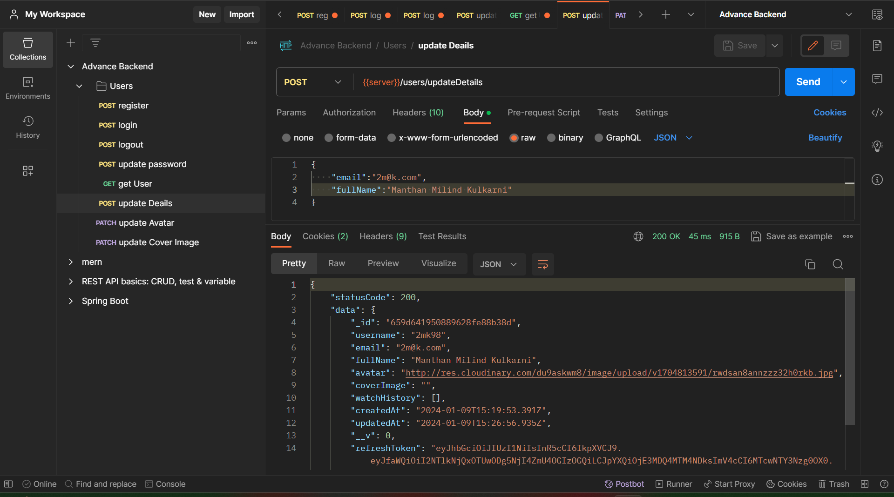
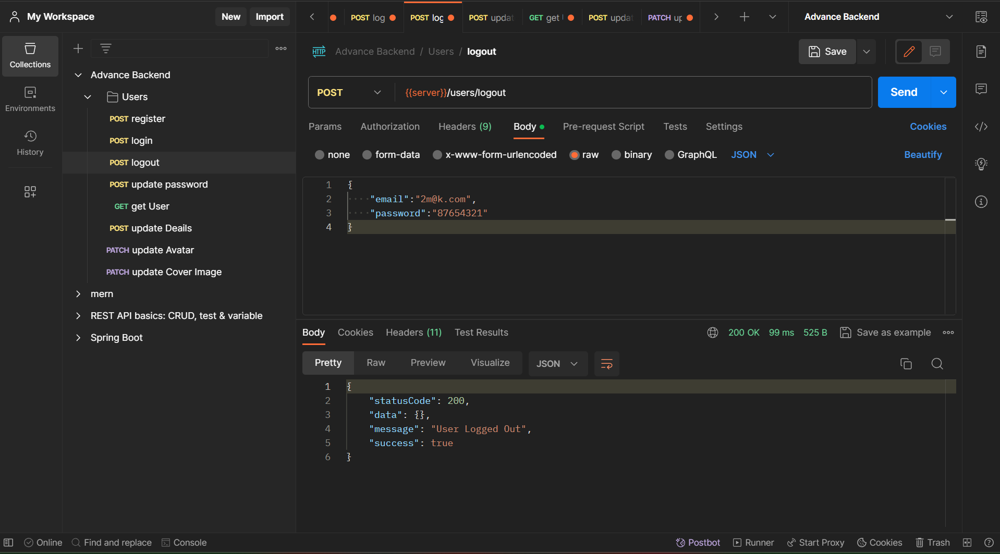

# Backend Professional Project

## This Project's Tech Stack: MongoDB, Mongoose(ORM), Express, Node, Javascript

- [Models Link](https://app.eraser.io/workspace/YtPqZ1VogxGy1jzIDkzj)

## Database - Configurations

## Register User

##  User Entry in DB

## Login User

## Update Password

## Update Password Verify

## Get Authenticated User

## Update User Details

## User Avatar Stored on Cloudinary

## Update User Avatar 

## Verify updated user avatar

## Logout user

